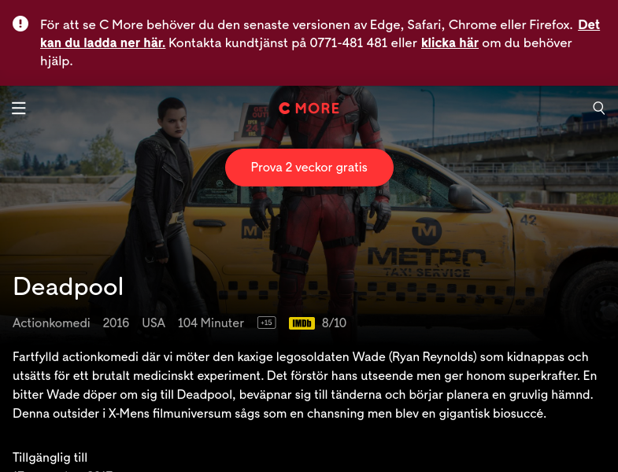
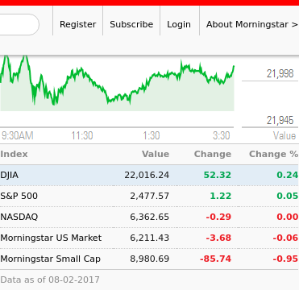

# {{.Name}}

{{render "license/shields" . "License" "MIT"}}
{{template "badge/godoc" .}}
{{template "badge/goreport" .}}
{{template "badge/travis" .}}

## {{toc 5}}

## {{.Name}} - Web to image

The `web2image` will take a screenshot of a given web page.

# Usage

### $ {{exec "web2image" | color "sh"}}

### chrome-headless

The following examples assumes that you've [setup chrome-headless](https://github.com/knq/chromedp/blob/master/examples/headless/README.md) already. Else, take a look at [Chrome DevTools Protocol](https://chromedevtools.github.io/devtools-protocol/) on how to start a local chrome with the remote-debugging-port opening at `9222`.

# Examples

## Film info from cmore.se

    web2image -d -c '#main-wrapper' 'http://www.cmore.se/film/3643033-deadpool' example-deadpool.png

and the result is:



## US market indexes chart

    web2image -d -s '5s' -c 'div > section.market-indexes-component > div.market-indexes-container' http://www.morningstar.com/ example-US-market-indexes.png

and the result is:



# Download binaries

The latest binary executables are available under  
https://bintray.com/suntong/bin/web2image#files/web2image  
as the result of the Continuous-Integration process.

I.e., they are built right from the source code during every git commit automatically by [travis-ci](https://travis-ci.org/).

Pick & choose the binary executable that suits your OS and its architecture. E.g., for Linux, it would most probably be the `-linux-amd64` file. If your OS and its architecture is not available in the download list, please let me know and I'll add it.

# Installation

To install the source code instead:

```
go get github.com/suntong/web2image
```

## Author

Tong SUN  


All patches welcome. 
